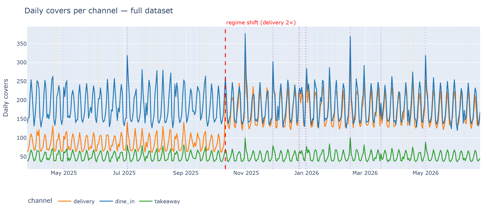
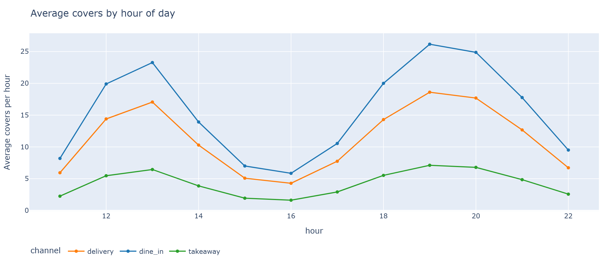
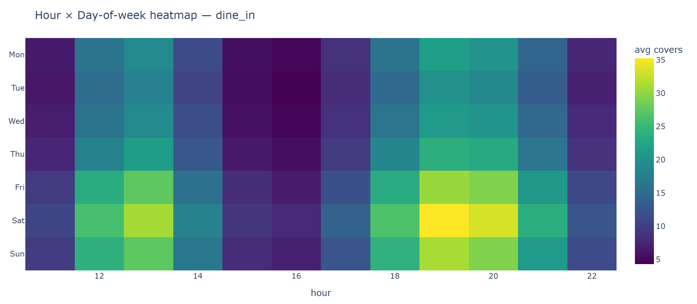
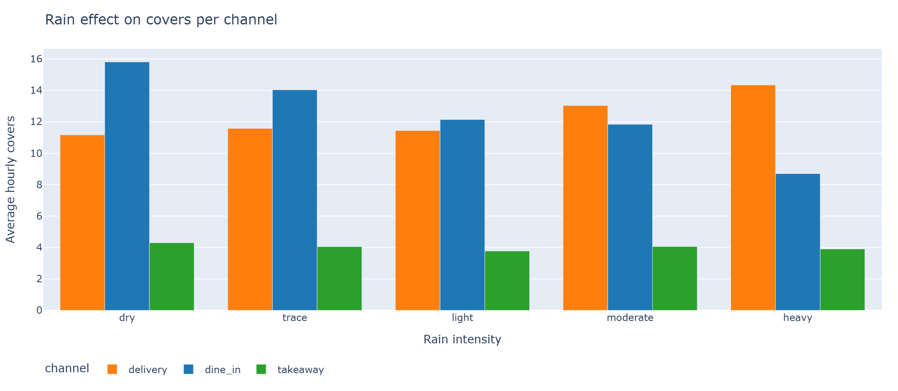

# Restaurant Management System (RMS) — Forecasting POC

> 🍽️ **Live demo:** **<https://rms-poc.streamlit.app/>**
>
> Click through the dashboard pages in the left sidebar. Submit a correction on the **Corrections** page and watch the SGD coefficients shift on **Coefficient Inspector**.

A forecasting + feedback-loop system for a single restaurant. Predicts **hourly covers**, **staffing**, and **ingredient orders** per channel (dine-in / delivery / takeaway), then learns online from manager corrections.

---

## Table of Contents

1. [What this project is](#1-what-this-project-is)
2. [Live demo](#2-live-demo)
3. [The problem](#3-the-problem)
4. [Philosophy — why this approach](#4-philosophy--why-this-approach)
    - 4.1 [Alternative considered — LLM with tools](#41-alternative-considered--llm-with-tools)
    - 4.2 [What I chose — hybrid ML model](#42-what-we-chose--hybrid-ml-model)
    - 4.3 [Why LightGBM as the base model](#43-why-lightgbm-as-the-base-model)
    - 4.4 [Why SGDRegressor as the online correction layer](#44-why-sgdregressor-as-the-online-correction-layer)
    - 4.5 [Why not SARIMAX, Prophet, or TFT](#45-why-not-sarimax-prophet-or-tft)
5. [Dataset insights — what the data tells us](#5-dataset-insights--what-the-data-tells-us)
    - 5.1 [Daily covers across the full window](#51-daily-covers-across-the-full-window)
    - 5.2 [Intraday demand shape](#52-intraday-demand-shape)
    - 5.3 [Saturday dinner is the binding peak](#53-saturday-dinner-is-the-binding-peak)
    - 5.4 [Rain reroutes demand across channels](#54-rain-reroutes-demand-across-channels)
    - 5.5 [One-paragraph summary](#55-one-paragraph-summary)
    - 5.6 [Operational implications](#56-operational-implications)
6. [Architecture](#6-architecture)
    - 6.1 [Two-layer model](#61-two-layer-model)
    - 6.2 [Data flow](#62-data-flow)
    - 6.3 [Per-channel design](#63-per-channel-design)
    - 6.4 [Feature set](#64-feature-set)
    - 6.5 [Reason tags](#65-reason-tags)
    - 6.6 [Residual clipping](#66-residual-clipping)
7. [Quick start — running locally](#7-quick-start--running-locally)
8. [Docker](#8-docker)
9. [Repository layout](#9-repository-layout)
10. [Dashboard walkthrough](#10-dashboard-walkthrough)
    - 10.1 [Dataset Explorer](#101-dataset-explorer)
    - 10.2 [Validation](#102-validation)
    - 10.3 [Today / Tomorrow](#103-today--tomorrow)
    - 10.4 [Order Sheet](#104-order-sheet)
    - 10.5 [Corrections](#105-corrections)
    - 10.6 [Model Health](#106-model-health)
    - 10.7 [Coefficient Inspector](#107-coefficient-inspector)
11. [API reference](#11-api-reference)
12. [The synthetic dataset](#12-the-synthetic-dataset)
13. [Metrics explained — MAE, MAPE, bias, R²](#13-metrics-explained--mae-mape-bias-r²)
14. [The feedback loop in detail](#14-the-feedback-loop-in-detail)
15. [Proving the model improves with data](#15-proving-the-model-improves-with-data)
16. [Tests](#16-tests)
17. [Deployment](#17-deployment)
    - 17.1 [Streamlit Community Cloud](#171-streamlit-community-cloud)
    - 17.2 [Hugging Face Spaces](#172-hugging-face-spaces)
    - 17.3 [Render](#173-render)
18. [Limitations and honest caveats](#18-limitations-and-honest-caveats)
19. [Future work](#19-future-work)
20. [Glossary](#20-glossary)
21. [Further reading](#21-further-reading)

---

## 1. What this project is

A proof-of-concept that a single restaurant can run **calibrated, self-improving forecasts** on cheap infrastructure with no ML platform team.

The system predicts three things for any upcoming day:

1. **Covers (customer count)** — broken down by hour and by channel (dine-in, delivery, takeaway).
2. **Staffing** — headcount per role per hour, derived from covers via configurable throughput.
3. **Ingredient orders** — quantities per ingredient over the supplier lead-time horizon, clipped by shelf life.

Predictions will be wrong. The system accepts manager corrections (e.g. *"you predicted 120 covers; I actually got 85 because of rain"*) and uses them to adjust its coefficients online. Forecasts converge toward accuracy as more corrections arrive.

This is **not** a one-shot model. It is a **feedback loop**.

---

## 2. Live demo

👉 **<https://rms-poc.streamlit.app/>**

A public Streamlit Community Cloud deployment. The first page load may take 30–60 seconds while the container bootstraps the synthetic dataset and trains the models. Subsequent loads are instant.

The hosted deployment exposes the dashboard only (no separate API surface). The dashboard calls the same Python service functions the API exposes locally — there is no functional difference.

Things to try on the live demo:

- **Dataset Explorer** → switch channels to see how rain affects each one.
- **Today / Tomorrow** → change the *Scenario (what-if reason tag)* dropdown between `normal`, `rain_heavy`, `event_holiday`, `promo`. Watch the hourly bars shift.
- **Corrections** → submit `actual = 20` for `dine_in` at `19:00` with reason `rain_heavy`. Then go to **Coefficient Inspector** → channel `dine_in` → see the `reason_rain_heavy` coefficient changed.
- **Model Health** → click *Retrain base* or *Reset SGD* and watch the registry update.

---

## 3. The problem

Restaurants lose money in two directions:

| Failure mode | Cost |
|---|---|
| **Over-resourcing** | Too many staff scheduled. Too much food ordered. Ingredients expire. |
| **Under-resourcing** | Understaffed shifts. Dishes go unavailable mid-service. Customers leave angry. |

Both stem from the same root cause: **demand for the next hour is uncertain**. The job of this system is to:

1. Forecast demand at the hour and channel granularity that operations actually run on.
2. Convert that forecast into the operational decisions (staff schedule, order sheet).
3. **Learn from being wrong**, so the same mistake is less likely tomorrow.

Item 3 is the differentiator. Anyone can build a one-shot forecaster. The interesting question is whether the system gets visibly smarter as managers feed it corrections.

---

## 4. Philosophy — why this approach

Before writing any code I considered two fundamentally different solutions. The chosen one is justified below by elimination.

### 4.1 Alternative considered — LLM with tools

The first solution I explored was an **agentic LLM** as the forecasting "brain", with three tools to gather context:

- **Tool A — historical lookup.** Queries the database for past observations matching the target day-of-week. For Monday's forecast it pulls every Monday in the database.
- **Tool B — local events lookup.** Returns local events, holidays, and other locality-specific information for the target date.
- **Tool C — weather lookup.** Fetches the weather forecast for the target date.

After collecting the outputs of these three tools, the LLM would synthesize a numeric prediction for that day.

**Why I did not proceed with this:**

LLMs are not good at numerical reasoning on their own. Asked to weight several signals and produce a single calibrated number, they make common arithmetic mistakes, anchor on the most recent input, and have no internal mechanism for **calibration to past errors**. They also cannot represent "the rain coefficient is `−0.06` for dine-in but `+0.03` for delivery" with any stability — every call is a fresh inference with no learned state.

A second, related issue: there is no clean way for an LLM to **learn online** from manager corrections without re-fine-tuning. Few-shot prompting with recent corrections degrades quickly once the context grows.

For a time-series forecasting problem where calibration and online adaptation are the whole game, the LLM-with-tools architecture is the wrong tool. It is excellent at unstructured reasoning; it is poor at numeric calibration with a feedback loop.

### 4.2 What I chose — hybrid ML model

This problem is **time-series forecasting** with hourly granularity, per-channel splits, calendar cycles, weather sensitivity, and the requirement to absorb manager corrections in real time.

The right tool family for time-series forecasting on tabular data is **gradient-boosted decision trees** for the structural part, plus an **online linear model** for the adaptive part. Stacked, they give us:

- The base model captures slow-moving, predictable structure (day-of-week, hour-of-day, weather sensitivity, holidays).
- The residual model captures fast-moving drift and human-tagged corrections.
- The combination is calibrated by construction and can update its coefficients on every single correction without retraining.

### 4.3 Why LightGBM as the base model

For tabular regression of this shape — moderate row count, mixed categorical and continuous features, strong interactions between features (`rain × channel × hour`), and the need to retrain weekly without manual tuning — **LightGBM gives the best accuracy-to-effort ratio** of any model class.

It handles categorical features natively (no manual one-hot encoding), discovers feature interactions through its split tree structure, trains in seconds on this dataset, and produces a single binary artifact per channel that can be persisted to disk and shipped.

### 4.4 Why SGDRegressor as the online correction layer

LightGBM has **no true online learning**. Its `init_model` parameter supports adding more trees to an existing booster, but that is **batch continuation** — it requires a batch of new data and a fresh training run. It is not a per-sample update mechanism.

`SGDRegressor` from scikit-learn supports **`partial_fit(x, y)`**: pass one row, take one gradient step, done. Milliseconds. This is the actual capability the correction loop needs.

The trade-off: SGD is linear. To capture non-linear residuals I would need a more powerful online learner. But because the base model already covers the non-linear structure, the residual layer's job is *calibration plus reason-tag handling*, both of which are well-served by a linear model.

The role split is therefore:

| Layer | Job | Cadence | Update mechanism |
|---|---|---|---|
| LightGBM base | Capture slow-moving structure across history | Weekly retrain | Batch (full data) |
| SGD residual | Absorb drift + manager corrections + reason-tag effects | Per correction | `partial_fit` (single row) |

When the manager gives feedback, the system reacts **immediately** — the next forecast call uses the updated SGD coefficients. That reactivity is the property a POC needs to demonstrate, and `partial_fit` is what makes it possible.

### 4.5 Why not SARIMAX, Prophet, or TFT

For a production-grade demand forecasting system on this domain, **SARIMAX** (seasonal ARIMA with exogenous regressors), **Prophet**, or **TFT** (Temporal Fusion Transformer) would all be defensible — and in some respects superior — choices.

I chose not to use them for this POC because:

- The point of this POC is to **demonstrate the feedback-loop architecture**, not to benchmark forecast accuracy.
- SARIMAX is harder to configure per channel (each channel needs its own (p,d,q)(P,D,Q,s)).
- Prophet is excellent for trend + seasonality but has limited support for exogenous regressors with non-linear interactions.
- TFT requires GPU for reasonable training time and adds a deep-learning dependency stack disproportionate to POC scope.

LightGBM + SGD is a **simpler, more interpretable** combination that captures the same operational behaviors and lets a stakeholder read the model's coefficients directly off the dashboard. Once the architecture pattern is validated, swapping the base model out for SARIMAX, TFT, or any other forecaster is a contained change — the residual layer is base-model-agnostic.

---

## 5. Dataset insights — what the data tells us

Before talking about the architecture, it is worth looking at the data the model trains on. Four figures convey the structure that drives every downstream decision. Full analysis (seven figures, all three per-channel heatmaps, dataset limitations) lives in **[docs/DATA_INSIGHTS.md](docs/DATA_INSIGHTS.md)**. The synthetic dataset's drivers and generator are documented in [Section 12](#12-the-synthetic-dataset).

### 5.1 Daily covers across the full window



Three things to notice:

- A **weekly sawtooth** in all three channels — weekends are heavier than weekdays.
- A **red dashed line** marks a regime shift: delivery roughly **doubles** its baseline from that day forward, while dine-in and takeaway are unaffected. This is the non-stationarity the residual layer is designed to absorb.
- Vertical dotted ticks are holidays (purple), local events (gold), promos (light blue). Holidays produce simultaneous spikes across all three channels — customers do not substitute between channels on a holiday, they raise overall consumption together.

### 5.2 Intraday demand shape



A clean **bimodal curve**: lunch peak around 12–14, dinner peak around 19–21. Dinner is the taller of the two. A pronounced dead zone between 15:00 and 17:00 — all three channels collapse there. This is the cell where staffing waste is biggest if a manager forces standard cover.

### 5.3 Saturday dinner is the binding peak



The brightest cell on the dine-in heatmap is **Saturday 19–20:00**, followed by Friday and Sunday at the same hour. Sunday lunch shows a secondary hot spot — a brunch / family-meal signature. Peak staffing should be anchored on the Saturday dinner cell; everything else sizes down from it.

### 5.4 Rain reroutes demand across channels



Customers do not disappear when it rains, they **change channel**:

- **Dine-in** drops monotonically as rain intensifies — heavy-rain hours land at roughly **60–70% of dry-hour volume**.
- **Delivery** rises mildly under light/moderate rain.
- **Takeaway** is essentially flat.

The dine-in loss is larger than the delivery gain, so total covers contract under rain — not all displaced dine-in customers convert to delivery. This is also why I train **one model per channel**: a single model with a global rain coefficient would average these effects out and predict badly for both.

### 5.5 One-paragraph summary

> Demand is driven primarily by a **calendar signal** (day-of-week + hour-of-day + holidays) that all three channels share, plus a **weather signal** that splits them: rain pushes demand from dine-in into delivery while takeaway is insensitive. A structural break inside the window doubles delivery's baseline — non-stationarity exists in the data and any forecaster must adapt to it. Customers behave like three semi-overlapping populations: weekend dine-out diners, rain-shifting delivery users, and steady takeaway buyers. Saturday dinner is the binding peak; the 15–17 dead zone is the binding waste opportunity.

### 5.6 Operational implications

| Decision | Anchor on |
|---|---|
| Peak staffing | Saturday 19–20:00 dine-in cell |
| Slow-hour cost cut | 15–17 mid-afternoon dead zone — partial shifts or prep block |
| Inventory safety stock | Holiday lift × shelf-life-constrained ingredients |
| Rain contingency | Reroute kitchen capacity to delivery on wet hours, expect net contraction |
| Promo ROI tracking | Measure lift per channel — total-revenue numbers will be misleading |
| Retrain cadence | Weekly base retrain absorbs cyclical patterns; the SGD residual handles regime shifts faster |

➡️ Full analysis with all seven figures, all three per-channel heatmaps, and dataset limitations: **[docs/DATA_INSIGHTS.md](docs/DATA_INSIGHTS.md)**.

---

## 6. Architecture

### 6.1 Two-layer model

```
                 ┌─────────────────────────────┐
Features  ─────► │  LightGBM base (per channel)│ ──► base_pred
                 │  Retrained weekly           │
                 └─────────────────────────────┘
                              │
                              ▼
              Features + base_pred + reason-tag one-hots
                              │
                              ▼
                 ┌─────────────────────────────┐
                 │  SGDRegressor (per channel) │ ──► residual_pred
                 │  Updated per correction     │
                 │  via partial_fit()          │
                 └─────────────────────────────┘
                              │
                              ▼
            final = max(0, base_pred + clip(residual, ±50% |base|))
                              │
                              ▼
                 ┌─────────────────────────────┐
                 │  Manager correction         │
                 │  residual_target =          │
                 │     actual − base_pred      │
                 │  sgd.partial_fit(X, target) │
                 └─────────────────────────────┘
```

### 6.2 Data flow

```
Synthetic generator ──► SQLite ──► Feature builder ──► LightGBM base
                                                       │
                                                       ▼
                                       Features + base_pred + reason tags
                                                       │
                                                       ▼
                                                  SGDRegressor
                                                       │
                                                       ▼
                              Predictions ◄────────────┘
                                       │
                                       ▼
                            FastAPI ◄──────────► Streamlit dashboard
                                       ▲
                                       │ POST /corrections
                                       │
                                  Restaurant manager
```

### 6.3 Per-channel design

The system trains **one base model and one residual model per channel**: dine-in, delivery, takeaway.

This is not a stylistic choice — it is forced by the data. Rain has **opposite signs** across channels: it reduces dine-in covers and increases delivery covers. A single combined model would average those out and predict badly for both. Per-channel models keep each channel's response curve honest.

### 6.4 Feature set

**Base features (17, used by LightGBM):**

| Group | Features |
|---|---|
| Calendar | `dow`, `hour`, `month`, `day_of_year_sin`, `day_of_year_cos`, `is_weekend` |
| Event | `is_holiday`, `is_local_event`, `event_severity`, `is_promo` |
| Weather | `temp`, `rain_mm`, `condition_code` |
| Lag | `lag_1d`, `lag_7d`, `dow_4w_mean`, `rolling_7d_mean` |

Categorical features (`dow`, `hour`, `month`, `condition_code`) are passed to LightGBM via native categorical handling.

**Residual features (28, used by SGD):** the 17 base features plus two interaction features (`rain_x_weekend`, `rain_x_dinner`), the base model's prediction itself (`base_pred`), and eight reason-tag one-hots (`reason_normal`, `reason_rain_heavy`, …).

### 6.5 Reason tags

When a manager submits a correction, they pick one tag from a closed vocabulary:

```
rain_heavy, rain_light, event_local, event_holiday,
promo, no_show_group, normal, other
```

Each tag is a one-hot input to the SGD residual model. The SGD learns one coefficient per tag, which is exposed on the **Coefficient Inspector** page. Over time, these coefficients become a learned mapping from manager-supplied labels to numeric adjustments.

The SGD is warm-started with reason tags derived from historical features (e.g. `rain_mm > 3 → rain_heavy`) so the dropdown is meaningful from day one. Manager corrections then refine those starting points.

### 6.6 Residual clipping

The final prediction is:

```
final = max(0, base_pred + clip(residual_pred, ±0.5 × |base_pred|))
```

The ±50% cap on the residual contribution ensures that:

- A single bad correction cannot shove the forecast to a wildly different value.
- The base model always retains majority influence on the prediction.
- Outlier corrections (typos, one-off chaos like a power outage) are absorbed without damaging the model's long-run behavior.

If a residual repeatedly hits the cap in the same direction, that is a signal the base model has drifted out of calibration and should be retrained.

---

## 7. Quick start — running locally

```bash
git clone https://github.com/Mahmud-007/RMS-POC
cd RMS-POC

python -m venv .venv
source .venv/Scripts/activate          # Windows: .venv\Scripts\Activate.ps1
# Linux / macOS: source .venv/bin/activate

pip install -r requirements.txt

# 1. Generate the synthetic dataset
python -m app.data.generator

# 2. Train the LightGBM base (one booster per channel)
python -m app.train.train_base

# 3. Warm-start the SGD residual layer
python -m app.train.init_sgd

# 4. Launch the dashboard
streamlit run dashboard/streamlit_app.py
#    → http://localhost:8501

# 5. (Optional) Launch the API in another terminal
uvicorn app.main:app --reload
#    → http://localhost:8000/docs
```

The Streamlit dashboard is the internal/admin surface. The FastAPI API serves the React manager app, external clients, and the smoke test suite.

### Running the full system locally (React + API + admin)

The system runs as three independent processes, mirroring the production split (React on Netlify, FastAPI on Render, Streamlit as admin):

```bash
# Terminal 1 — backend API (serves the React app + admin)
uvicorn app.main:app --reload
#   → http://localhost:8000   (OpenAPI docs at /docs)

# Terminal 2 — React manager frontend
cd frontend
npm install
npm run dev
#   → http://localhost:5173

# Terminal 3 — Streamlit admin dashboard (optional, technical views)
streamlit run dashboard/streamlit_app.py
#   → http://localhost:8501
```

| Surface | URL | Audience | Pages |
|---|---|---|---|
| React app | http://localhost:5173 | Restaurant manager | Home, Forecast, Orders, Feedback |
| FastAPI | http://localhost:8000 | Clients / React | REST + OpenAPI docs |
| Streamlit | http://localhost:8501 | Data team / admin | Dataset Explorer, Validation, Coefficient Inspector, Model Health |

The React frontend reads `VITE_API_BASE` (default `http://localhost:8000`) from `frontend/.env`. See [frontend/README.md](frontend/README.md) for details.

---

## 8. Docker

```bash
docker build -t rms .
docker run -p 7860:7860 -p 8000:8000 -v $(pwd)/artifacts:/srv/artifacts rms
```

The image starts the API on port `8000` and the dashboard on port `7860` (the port Hugging Face Spaces expects). The `artifacts/` mount lets the SQLite database and persisted models survive container restarts.

If `artifacts/rms.db` is missing on container start, the entrypoint will bootstrap it: generate the dataset and train both models before starting the servers. This means a clean `docker run` produces a working demo with zero manual setup.

---

## 9. Repository layout

```
RMS/
├── app/
│   ├── api/                FastAPI routers (forecast, corrections, training, metrics)
│   ├── data/               Synthetic data generator + schema.sql
│   ├── eval/               Holdout evaluation + backtest replay harness
│   ├── features/           Feature builder (calendar, weather, lags, interactions, reason-tags)
│   ├── models/             LightGBM wrapper, SGD residual, swappable Protocol
│   ├── predict/            Service layer for covers / staff / orders
│   ├── train/              Base trainer + SGD warm-start
│   ├── scheduler.py        APScheduler weekly base retrain
│   └── main.py             FastAPI app
├── dashboard/
│   └── streamlit_app.py    7-page Streamlit dashboard
├── docs/
│   ├── DATA_INSIGHTS.md    Customer-behaviour analysis of the synthetic dataset
│   └── figures/            Static PNG figures for the insights doc
├── artifacts/              Generated DB + model pkls (gitignored)
├── tests/                  Pytest smoke tests
├── .streamlit/             Streamlit config for cloud deploys
├── Dockerfile
├── requirements.txt
├── PLANNING.md             Initial architecture and scope reference
├── AGENTS.md               Decision log: every feature, alternative, trade-off
└── README.md               This file
```

---

## 10. Dashboard walkthrough

The dashboard has seven pages selectable from the left sidebar. Recommended demo order:

### 10.1 Dataset Explorer

Inspect the data the model trains on. Filters: date range, channels. Charts:

- Daily covers per channel, with vertical markers for holidays, local events, promos, and the regime shift.
- Average covers by hour-of-day (lunch peak ~13:00, dinner peak ~19:00).
- Average covers by day-of-week (Saturday peak, Tuesday trough).
- Hour × day-of-week heatmap, per channel.
- Rain bucket bar chart (dry / trace / light / moderate / heavy) per channel.

Use this page to confirm the dataset has the structure the model is supposed to learn from.

### 10.2 Validation

Base-model accuracy on the last 28-day holdout window. Per-channel summary table (MAE, MAPE, bias, R²). Actual-vs-predicted line charts per channel. Useful as the calibration check before you trust any other page.

### 10.3 Today / Tomorrow

Operational forecast for a chosen date.

- **Date picker** defaults to tomorrow.
- **Scenario dropdown** — pick a reason tag to ask "what does the model predict if managers tag this day as `rain_heavy`?". Useful for capacity planning under hypotheticals.
- **Hourly cover forecast** — stacked bar per channel.
- **Daily channel totals** — three metric cards.
- **Recommended staffing** — per-hour, per-role table + daily person-hours per role.
- **Base vs residual breakdown** (collapsible) — shows where the residual layer is adding or subtracting on top of the base.

### 10.4 Order Sheet

Ingredient orders over the supplier lead-time horizon.

- **Horizon slider** — defaults to `max(lead_time_days) + 1 safety day` across all ingredients.
- **Ingredient table** — name, unit, stock, forecast need, shelf-life cap, raw order, recommended order.
- **Shelf-life warnings** appear when the cap is binding (the recommended order is less than the raw need because the kitchen cannot use the surplus before spoilage).
- **Approve order** button — a no-op stub for the POC; would integrate with a supplier API in production.

### 10.5 Corrections

The feedback loop.

- Pick `(date, hour, channel)`, type the actual covers, pick a reason tag, submit.
- The response card shows: base prediction, residual prediction before and after the gradient step, raw and clipped target residual, and the new `n_updates` counter.
- The corrections table below logs every submission.

This is where the model gets smarter. Every submission moves the SGD coefficients.

### 10.6 Model Health

Operational view of model state.

- Validation summary table (base only).
- Activity metrics per channel (correction count, SGD update count).
- Daily MAE chart on the holdout window.
- **Backtest replay**: window slider, naive-vs-base-vs-hybrid summary table, per-channel rolling MAE chart.
- **Retrain base** and **Reset SGD residual** buttons — re-run the trainers in-process and show summary JSON.
- Full model registry table.

### 10.7 Coefficient Inspector

What the model has learned.

- **Channel selector** — pick which booster + SGD to inspect.
- **Left chart** — LightGBM feature importance (gain) as a horizontal bar.
- **Right chart** — signed SGD coefficients (green positive, red negative). Reason-tag coefficients are visible here. Submit corrections on the **Corrections** page, refresh this page, and you can see the relevant coefficient move.

---

## 11. API reference

```
GET  /health
GET  /forecast/covers?target=YYYY-MM-DD[&channel=…][&reason_tag=…]
GET  /forecast/staff?target=YYYY-MM-DD
GET  /forecast/orders?start=YYYY-MM-DD&end=YYYY-MM-DD
POST /corrections                  body: {ts, channel, actual, reason_tag}
POST /train/base                   triggers background base retrain
POST /train/sgd/reset              warm-start the SGD residual layer
GET  /metrics[?rolling_days=30]
GET  /metrics/registry
GET  /metrics/coefficients[?channel=…]
```

Full OpenAPI documentation at `http://localhost:8000/docs` when running `uvicorn app.main:app`.

### Example — submitting a correction

```bash
curl -X POST http://localhost:8000/corrections \
  -H "Content-Type: application/json" \
  -d '{
    "ts": "2026-06-27T19:00:00",
    "channel": "dine_in",
    "actual": 20,
    "reason_tag": "rain_heavy"
  }'
```

Response:

```json
{
  "base_pred": 32.03,
  "residual_pred_before": 1.05,
  "residual_pred_after": 1.21,
  "actual": 20.0,
  "target_residual": -12.03,
  "target_residual_clipped": -16.01,
  "n_updates": 5413,
  "model_version": "v..."
}
```

---

## 12. The synthetic dataset

No real restaurant data was available for this POC, so the system runs on a **reproducible synthetic dataset** generated by `app/data/generator.py`.

The generator produces ~15 months of hourly observations across three channels with **known ground-truth drivers**, which lets the evaluation harness measure how close the trained model gets to the real coefficients.

Injected drivers:

| Driver | Mechanism |
|---|---|
| Day of week | Multiplicative — weekend ≈ 1.3–1.4×, midweek ≈ 0.8–0.95× |
| Hour of day | Two-peak service curve (lunch ~13:00, dinner ~19:00) |
| Weather | Seasonal temperature sinusoid + daily cycle + storm bursts; rain has channel-specific sensitivity (`dine_in = −0.06`, `delivery = +0.03`, `takeaway = −0.01` per mm) |
| Holidays | Fixed dates, multiplier `1.45` |
| Local events | Random ~5% of days, severity-weighted multiplier up to `1.25` |
| Promos | Random ~10% of days, multiplier `1.18` |
| Regime shift | Delivery base volume doubles from a specific day onward — used to exercise the residual layer's drift-handling |
| Noise | ~10% multiplicative Gaussian |

Also seeded: 12 ingredients with realistic shelf-life and lead-time values, 8 menu items with full recipe BOM, daily dish-mix history (Dirichlet-sampled per day, sums to 1.0), and 4 staff roles with covers-per-hour throughput.

Reproduce the figures from the dataset:

```bash
python -m app.eval.insights   # writes PNGs into docs/figures/
```

For a deeper customer-behavior analysis with embedded figures, see [docs/DATA_INSIGHTS.md](docs/DATA_INSIGHTS.md).

---

## 13. Metrics explained — MAE, MAPE, bias, R²

The Validation page and Model Health page show four metrics. Each captures a different failure mode.

### MAE — Mean Absolute Error

```
MAE = (1/n) · Σ |ŷᵢ − yᵢ|
```

*"On average, how many covers off was the model?"* In the same units as the target (covers per hour). Intuitive and treats over- and under-prediction equally. Does not get inflated by a single huge miss the way MSE does.

### MAPE — Mean Absolute Percentage Error

```
MAPE = (1/n) · Σ |ŷᵢ − yᵢ| / yᵢ     (skipped where yᵢ = 0)
```

*"On average, how many percent off was the model?"* Unit-free. On the synthetic dataset the model lands at ~10% MAPE, which matches the 10% multiplicative noise injected by the generator — the model has reached the **irreducible noise floor**.

### Bias

```
bias = (1/n) · Σ (ŷᵢ − yᵢ)
```

*"Does the model lean systematically high or low?"* MAE measures magnitude; bias measures direction. A model can have low MAE and high bias if it is consistently off in one direction by a small amount.

In this system, the **delivery channel shows persistent negative bias (≈ −0.30)** on the validation window. This is the signature of the synthetic regime shift: delivery's base volume doubles partway through the data, and the base model under-predicts the post-shift period. The SGD residual layer's job is to absorb exactly this kind of structural bias.

### R² — Coefficient of determination

```
R² = 1 − Σ(yᵢ − ŷᵢ)² / Σ(yᵢ − ȳ)²
```

*"What fraction of the variation in actuals can the model explain?"* Range 0–1 (negative values mean worse than predicting the mean). A complement to MAE: MAE is in absolute units, R² is unit-free.

A practical rule of thumb for restaurant demand:

| R² | Reading |
|---|---|
| < 0.5 | The model is not learning the basic cycles |
| 0.7 – 0.9 | Respectable |
| > 0.9 | Near noise floor on synthetic data; on real data, double-check for leakage |

---

## 14. The feedback loop in detail

The mechanics of a single correction:

```python
def on_correction(ts, channel, actual, reason_tag):
    # 1. Look up the base prediction at this timestamp
    base = load_latest_base(channel)
    X_base = build_inference_row(ts, channel)
    base_pred = base.predict(X_base)

    # 2. Build the SGD input row including the manager's reason tag
    X_sgd = append_residual_features(X_base, base_pred, reason_tag)

    # 3. Compute the residual target — clip to ±50% of |base|
    residual_target = actual - base_pred
    cap = abs(base_pred) * sgd.clip_fraction
    target_clipped = clip(residual_target, -cap, +cap)

    # 4. One online gradient step
    sgd.partial_fit([X_sgd], [target_clipped])

    # 5. Persist
    sgd.save(path)
    log_correction(...)
```

After step 4, the SGD's coefficient vector has moved. The next prediction call will produce a slightly different number — the model has been updated.

Important properties:

- **Bounded.** Step 3 ensures no single correction can shift the forecast by more than 50% of the base value.
- **Interpretable.** Step 4 updates a vector of weights, one per feature. The Coefficient Inspector page reads this vector directly.
- **Stateful.** Step 5 makes the change persistent across server restarts.
- **Fast.** All five steps complete in low single-digit milliseconds.

---

## 15. Proving the model improves with data

Four levels of evidence, weakest to strongest.

**Level 1 — Per-correction shift (instant proof).** On the Corrections page, the response card shows `Residual (before)` and `Residual (after)`. A non-zero, signed delta is direct evidence that the gradient step moved the model in the right direction.

**Level 2 — Coefficient drift over a session (interpretable proof).** On the Coefficient Inspector page, note the value of `reason_rain_heavy` for `dine_in`. Submit five corrections with `reason_tag=rain_heavy`, all with `actual` consistently below the base prediction. Reload the inspector. The coefficient should be **visibly more negative**. The model has learned the manager's intended meaning of the tag.

**Level 3 — Backtest convergence (rigorous proof).** The Model Health page includes a backtest replay that walks the last N days hour-by-hour. A fresh SGD is warm-started on data *before* the window, then trained forward by submitting one synthetic correction per hour. The chart compares three variants:

- **Naive** — same day-of-week 4-week average
- **Base** — LightGBM only
- **Hybrid** — LightGBM + SGD residual

On the stationary baseline window the hybrid roughly matches the base — *which is the correct result*: the base is already calibrated, and the SGD layer is correctly contributing near-zero rather than injecting noise. The hybrid's value materializes on non-stationary periods (regime shifts) and on reason-tagged corrections.

**Level 4 — Holdout MAE before/after a correction batch.** Capture the validation MAE, submit a batch of well-targeted corrections, re-measure. A meaningful drop in MAE is the cleanest end-to-end proof of improvement.

---

## 16. Tests

```bash
python -m pytest tests/ -v
```

The smoke test suite covers:

- `/health` endpoint
- `/forecast/covers` for all channels and channel-filtered, with the residual-clip invariant (`|residual_pred| ≤ 0.5 × |base_pred|`)
- `/forecast/staff` shape and role coverage
- `/forecast/orders` with the shelf-life cap invariant
- `POST /corrections` round-trip: target residual sign, clip magnitude, `n_updates` increment
- `POST /corrections` rejects unknown `reason_tag` with HTTP 422
- `/metrics`, `/metrics/registry`, `/metrics/coefficients` shape and key contents
- Service-level `predict_day` and `predict_orders`

Tests assume the synthetic dataset has been generated and both models trained. The Docker entrypoint and the dashboard bootstrap both handle this automatically, so tests work after a clean clone followed by the three quick-start commands.

---

## 17. Deployment

The dashboard is designed to run on **free-tier hosting** with zero cost. Three paths are tested.

### 17.1 Streamlit Community Cloud

The current live deployment at **<https://rms-poc.streamlit.app/>** runs on Streamlit Community Cloud.

1. Sign in at <https://share.streamlit.io> with GitHub.
2. **New app** → select repo, branch `main`, main file `dashboard/streamlit_app.py`.
3. Deploy.

The first page load runs the bootstrap (~30–60 seconds) since the cloud's filesystem is ephemeral. Subsequent loads are instant.

Limits: 1 GB RAM, public app, no separate API surface, SQLite resets when the container restarts (corrections submitted on the live demo are lost after a sleep cycle).

### 17.2 Hugging Face Spaces

For a full Docker deployment that keeps both API and dashboard, push the repo to a Docker Space:

1. Create a new Space with **SDK: Docker**.
2. Add the HF remote: `git remote add hf https://huggingface.co/spaces/<username>/<space-name>`.
3. Push: `git push hf main`.

The YAML frontmatter at the top of this file is read by Hugging Face to configure the Space (`sdk: docker`, `app_port: 7860`). GitHub renders the README skipping the frontmatter.

Limits: 2 vCPU, 16 GB RAM on the free CPU tier. Ephemeral filesystem (the bootstrap re-runs on cold start).

### 17.3 Render

For an always-on URL with persistent storage:

1. Connect the GitHub repo at <https://render.com> → New Web Service → Docker runtime.
2. Free plan.
3. Add a 1 GB free disk mounted at `/srv/artifacts` so the SQLite database survives restarts.

Limits: 750 hours/month free, 15-minute sleep after inactivity, ~60-second cold start.

---

## 18. Limitations and honest caveats

This is a POC. The following are known limitations that would need to be addressed before a production deployment.

- **Synthetic data.** Real demand has heavier-tailed noise (no-shows, group bookings, viral moments). The 10% multiplicative Gaussian floor I trained against is optimistic.
- **Single restaurant.** Multi-tenant support is not implemented. Adding it would require a `restaurant_id` everywhere plus row-level access control.
- **No authentication.** Anyone can submit corrections and trigger retrains. Acceptable for a demo; not acceptable for production.
- **Point forecasts only.** No confidence intervals. Quantile regression or conformal prediction would close this gap.
- **No menu-item-level forecasting.** Predictions are at the channel level. Dish-level substitution and popularity drift are not modeled.
- **Reason-tag vocabulary is closed.** Adding a new tag requires a code change and a SGD reset (because the one-hot dimensionality changes).
- **Supplier API not integrated.** The Order Sheet's *Approve order* button is a no-op.
- **Linear residual layer.** If residuals against the base turn out to be genuinely non-linear in ways that hand-crafted interaction features cannot capture, the residual layer would need to be swapped for a tree-based online learner. The `ResidualModel` Protocol in `app/models/interfaces.py` allows this swap without touching the rest of the system.
- **Free-tier storage is ephemeral.** On Streamlit Cloud and HF Spaces free tiers, the database and persisted models are wiped on container restart. The bootstrap regenerates them but corrections submitted between restarts are lost. Use Render with a free disk for persistent demos.

---

## 19. Future work

Ranked by value-per-effort:

1. **`predict_holdout_hybrid()`** — adds a base-vs-hybrid side-by-side view on the Validation page, directly proving the residual layer's value.
2. **Drift-injection scenario** — backtest variant that multiplies actuals by `0.7` from a chosen midpoint to dramatize the convergence story.
3. **Pre-correction prediction logging** — persist every forecast to the `predictions` table so the `/metrics` rolling MAE is computed against true predictions instead of inferred from the holdout.
4. **CI workflow** — GitHub Actions that install, bootstrap, train, run tests.
5. **Shift-pack optimization** — replace greedy packing with a small MIP for cost-minimal staffing schedules.
6. **Per-channel dish mix** — currently restaurant-level; splitting by channel would improve order accuracy.
7. **Confidence intervals** — quantile regression on the base or conformal prediction.
8. **Real data ingestion** — POS API → SQLite, with the "max timestamp ≤ now" invariant enforced at the ingestion boundary.
9. **Multi-tenant** — `restaurant_id` everywhere plus auth.
10. **Supplier API integration** — wire the *Approve order* button to a real supplier endpoint.

---

## 20. Glossary

| Term | Meaning |
|---|---|
| **Channel** | The route a customer's order takes — dine-in, delivery, or takeaway. Each gets its own model. |
| **Cover** | A single customer/order. The forecasting target. |
| **Feature** | One column of the input vector the model sees. Examples: `dow`, `rain_mm`, `is_holiday`. |
| **dow** | Day of week. `0 = Monday … 6 = Sunday`. |
| **Lag feature** | A feature computed from past observations of the target. Example: `lag_7d` = covers at the same hour seven days ago. |
| **Residual** | The gap between actual and predicted — `actual − ŷ`. The residual layer is a second model trained to predict that gap. |
| **Reason tag** | A short categorical label a manager attaches to a correction (`rain_heavy`, `promo`, …) that the SGD layer learns to interpret. |
| **Warm-start** | Initialising the SGD residual by fitting it once on residuals against the latest base, rather than starting at zero. |
| **`partial_fit`** | scikit-learn's per-sample update method. The capability that makes online learning possible. |
| **Base model** | LightGBM. Slow-moving, retrained weekly, captures structural patterns. |
| **Residual model** | SGDRegressor. Fast-moving, updated per correction, captures drift and reason-tag effects. |
| **Clip fraction** | The cap on the residual layer's contribution, `±0.5 × |base_pred|`. Bounds the influence of any single correction. |
| **Regime shift** | A structural break in the data — for example, the synthetic delivery volume doubling at a specific date. The residual layer's principal stress test. |
| **MAE** | Mean Absolute Error. Average miss size in the target's units. |
| **MAPE** | Mean Absolute Percentage Error. Average miss size as a fraction of actual. |
| **Bias** | Average signed error. Positive = systematic over-prediction. |
| **R²** | Coefficient of determination. Fraction of variance explained. |

---

## 21. Further reading

- [PLANNING.md](PLANNING.md) — initial architecture document and scope reference.
- [AGENTS.md](AGENTS.md) — living decision log: every feature implemented, every alternative considered, every trade-off, in append-only chronological order with full rationale.
- [docs/DATA_INSIGHTS.md](docs/DATA_INSIGHTS.md) — customer-behavior analysis of the synthetic dataset with embedded figures and operational implications.

For a one-line technical pitch:

> A LightGBM base model that learns structural restaurant demand patterns, plus an SGDRegressor residual layer that absorbs manager-tagged corrections in real time through `partial_fit`. Per-channel models, residual capped at ±50% of base, all served through a 7-page Streamlit dashboard and a FastAPI surface.
