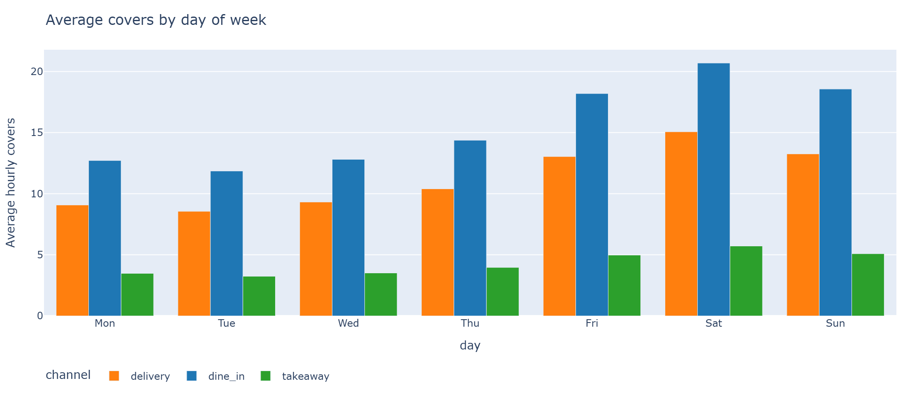
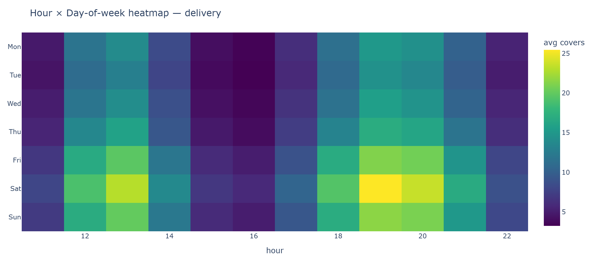
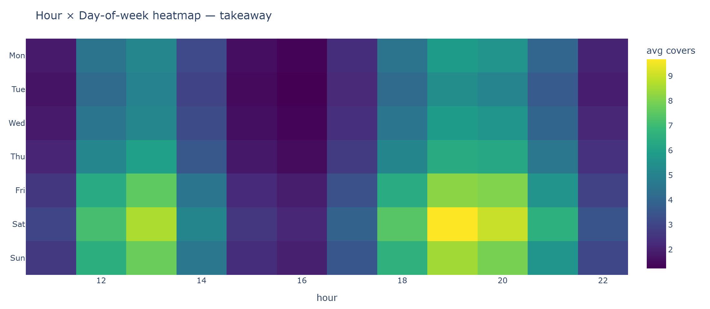

# Data Insights — Synthetic Dataset

> **Source.** Synthetic dataset generated by [`app/data/generator.py`](../app/data/generator.py) (see FEAT-001 / FEAT-002 in [AGENTS.md](../AGENTS.md)) and visualised by the Streamlit Dataset Explorer page.
> **Figures.** Reproduced by [`app/eval/insights.py`](../app/eval/insights.py). Re-run after every regeneration: `python -m app.eval.insights`.
> **Scope.** This document analyses *customer behaviour* and *operational implications* — it does **not** evaluate model accuracy (see the Validation page and FEAT-004 for that).

---

## At a glance

| Dimension | Finding |
|---|---|
| Cycle | Strong weekly periodicity across all channels |
| Peak | Saturday dinner (19–20h), dine-in dominated |
| Trough | Tuesday lunch + mid-afternoon dead zone (15–17h) |
| Weather | Rain shifts demand from dine-in to delivery; takeaway insensitive |
| Holidays | Sharp positive multiplier on all channels simultaneously |
| Promos | Real lift, uneven by channel (takeaway barely responds) |
| Stationarity | Broken on **2025-10-11** — delivery base doubles. Non-stationary dataset. |

---

## 1. Daily covers — the macro view


**What we see**

- A consistent sawtooth pattern across the year — weekends rise above weekdays in every channel.
- A red dashed line on **2025-10-11** marks a structural break: delivery (orange) roughly doubles its baseline from that day forward. Dine-in and takeaway are unaffected.
- Purple dotted ticks are holidays; gold are local events; light-blue are promo days. Holidays produce a near-simultaneous spike across all three channels.

**Customer behaviour interpretation**

- Demand is **calendar-driven first**: the same weekday and the same time of year produce similar patterns. Habits, not surprises, drive the bulk of the curve.
- The October step is **not** a noise artefact. Real-world analog: a new aggregator went live, a competitor closed, or pricing changed. The behavioural population doesn't change — the addressable market does.
- Holidays are a shared lift signal: customers don't substitute *between* channels on a holiday; they raise overall consumption together.

**Modelling implication**

- Any forecaster trained pre-2025-10-11 will systematically under-predict delivery post-shift until it relearns. This is exactly the gap the SGD residual layer will close after a manager submits a few corrections.

---

## 2. Hour of day — intraday shape


**What we see**

- A clean bimodal curve — lunch peak around 12–14, dinner peak around 19–21. Dinner is the taller of the two.
- A pronounced dead zone between 15:00 and 17:00. All three channels collapse there.
- Channel relative shares shift across hours: dine-in dominates dinner, delivery's share rises late evening.

**Customer behaviour interpretation**

- Two distinct customer occasions: workday lunch and evening dine-out / order-in. They are not the same customers and not the same use cases.
- The dead zone reflects a fixed cultural pattern (post-lunch / pre-dinner gap), not pricing or supply.
- Evening behaviour bifurcates by channel: people who choose to leave home (dine-in) versus those who stay (delivery).

**Operational implication**

- The 15–17 window is a candidate for shortened shifts, prep time, or a happy-hour promo to fill the gap. Forcing standard staffing through it is pure waste.

---

## 3. Day of week — the weekly cycle



**What we see**

- Fri / Sat / Sun roughly 1.3–1.4× the midweek mean. Tue is the trough.
- Dine-in shows the steepest weekday-to-weekend slope.
- Delivery and takeaway are flatter — their floor is closer to their peak.

**Customer behaviour interpretation**

- **Dining out is a discretionary, weekend-clustered behaviour.** Customers concentrate it where they have leisure time.
- **Delivery and takeaway are more utility-like.** They serve weeknight convenience, not weekend leisure. The "always-on" baseline is bigger relative to the peak.
- This explains a strategic truth about restaurant economics: dine-in revenue is volatile and tied to mood/weather/social plans; off-premise revenue is steadier and less prestige-bound.

---

## 4. Hour × day-of-week heatmap

Per-channel heatmaps surface *where* the demand peak lives.

| Channel | Heatmap |
|---|---|
| dine-in |  |
| delivery |  |
| takeaway |  |

**What we see**

- **dine-in** — the brightest cell is Saturday 19–20h, followed by Friday and Sunday at the same hour. A second hot spot is Sunday lunch (a brunch / family-meal signature).
- **delivery** — peak shifts later into the evening. The weekday lunch row is also visibly warm.
- **takeaway** — much more uniform; the daily cycle dominates, the weekly cycle adds only a mild tilt toward the weekend.

**Operational implication**

- **Peak staffing should be anchored on Saturday 19–20h dine-in.** That cell binds the schedule; everything else is sized down from it.
- Delivery and takeaway demand inventory that is steady across the week; dine-in demands a sharply scheduled crew.

---

## 5. Rain effect — channel substitution


**What we see**

- Dine-in covers decline monotonically as rain intensifies: heavy-rain hours land at roughly 60–70% of dry-hour volume.
- Delivery rises mildly under light / moderate rain — a substitution effect.
- Takeaway is approximately flat across rain buckets.

**Customer behaviour interpretation**

- Customers don't disappear when it rains; they **reroute their channel**. Same hunger, different fulfilment.
- The strength of the dine-in drop and the smaller delivery lift implies a *net negative* on total covers — not all dine-in lost is converted to delivery (some give up entirely). Capacity planning under rain should expect overall demand contraction, not just channel mix change.
- Takeaway buyers behave more like planned-ahead consumers — already committed to picking up, weather doesn't change their decision in real time.

**Modelling implication**

- A single global rain coefficient (linear, no interaction with channel) would learn an average and predict poorly on both sides. This is the core reason for **per-channel models** (see FEAT-004): each booster learns its own rain response.

---

## One-paragraph executive summary

Customer demand is driven primarily by a **calendar signal** (day-of-week + hour-of-day + holidays) that the three channels share, plus a **weather signal** that splits them: rain pushes demand from dine-in into delivery while takeaway is insensitive. A structural break in October 2025 doubles delivery's baseline — non-stationarity exists in the data and any forecaster must adapt to it without a full retrain. Customers behave like three semi-overlapping populations: weekend dine-out diners, rain-shifting delivery users, and steady takeaway buyers. The Saturday dinner cell is the binding peak; the 15–17 dead zone is the binding waste opportunity.

---

## Operational implications

| Decision | Anchor on |
|---|---|
| Peak staffing | Saturday 19–20h dine-in cell |
| Slow-hour cost cut | 15–17 mid-afternoon dead zone — partial shifts or prep block |
| Inventory safety stock | Holiday lift × shelf-life-constrained ingredients (chicken, beef, basil) |
| Rain contingency | Reroute kitchen capacity to delivery on wet hours, expect net contraction |
| Promo ROI tracking | Measure lift per channel — total-revenue numbers will be misleading |
| Forecast retraining cadence | Weekly base retrain is enough for cyclical patterns; the SGD residual must handle regime shifts faster |

---

## What this dataset cannot tell us

- **Synthetic.** Real-world demand has heavier-tailed noise: no-shows, group bookings, viral social moments. The "10% multiplicative Gaussian" floor here is optimistic.
- **No menu-item demand.** Cannot infer dish-level substitution or popularity drift.
- **No customer identifier.** Cannot separate "more customers" from "same customers, larger party size" or detect repeat-visit dynamics.
- **No price or cost columns.** Revenue and margin analysis impossible — this is a *volume* dataset.
- **One restaurant.** Patterns will not transfer cleanly to another venue type (QSR, fine dining, banquet) without re-tuning the generator coefficients.

The dataset is appropriate for proving the **forecasting + feedback loop** architecture works end-to-end. It is **not** appropriate as a benchmark for absolute prediction accuracy on a real venue.

---

## How to reproduce the figures

```bash
# from repo root
python -m app.data.generator      # if you've regenerated the dataset
python -m app.eval.insights       # writes PNGs into docs/figures/
```

For interactive exploration of the same data, launch the dashboard:

```bash
streamlit run dashboard/streamlit_app.py
```

then open the **Dataset Explorer** page.
